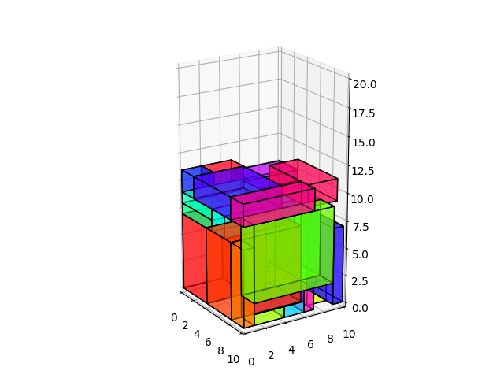

# Optimal Packing App 📦

The Optimal Packing App is a powerful tool designed to solve complex packing problems. Whether you're dealing with 2D or 3D spaces, designed algorithms ensure efficient packing solutions.

## Features

### 2D Packing Solutions:
- **GA + BLF**: Utilizes Genetic Algorithm combined with Bottom-Left Fill.
- **GA (using Evotorch) + BLF**: Uses GA from Evotorch library and combines it with Bottom-Left Fill.
- **Pointer Network + MAXRECT**: Uses a Pointer Network approach combined with the MAXRECT algorithm.

### 3D Packing Solutions:
- **GA + DBLF**: Implements Genetic Algorithm combined with Deepest Bottom-Left Fill.
- **GA (using Evotorch) + DBLF**: Uses GA from Evotorch library and combines it with Deepest Bottom-Left Fill.
- **Pointer Network + DBLF**: Uses a Pointer Network approach combined with the Deepest Bottom-Left Fill algorithm.

Additionally, a mobile app was developed for this project that uses AR to enhance 3D problem visualization:


## Results

The app outputs a 2D or 3D plot for the given problem.




## App architecture


## Installation

To get started with the Optimal Packing App:

1. Clone the repository:
   ```bash
   git clone https://github.com/mwitjez/Optimal-packing.git
    ```

2. Navigate to the project directory and install the required packages:
   ```bash
    cd Optimal-packing
    pip install -r requirements.txt
    ```
## API Reference

The project offers an API to solve 3D optimal packing problems.

### Pack Objects
Endpoint:

```http
POST /packit
```
Sample Request Body:

```json
{
  "cuboids": [
    {
      "width": 4,
      "height": 1,
      "depth": 10
    },
    {
      "width": 5,
      "height": 5,
      "depth": 9
    }
  ]
}
```
## Authors
- [@Mateusz Witka-Jeżewski](https://www.github.com/mwitjez)

## References
- Scalable Evolutionary Computation in Python (https://github.com/nnaisense/evotorch)
- rectpack (https://github.com/secnot/rectpack)
- Pointer Network (https://github.com/shirgur/pointernet)
